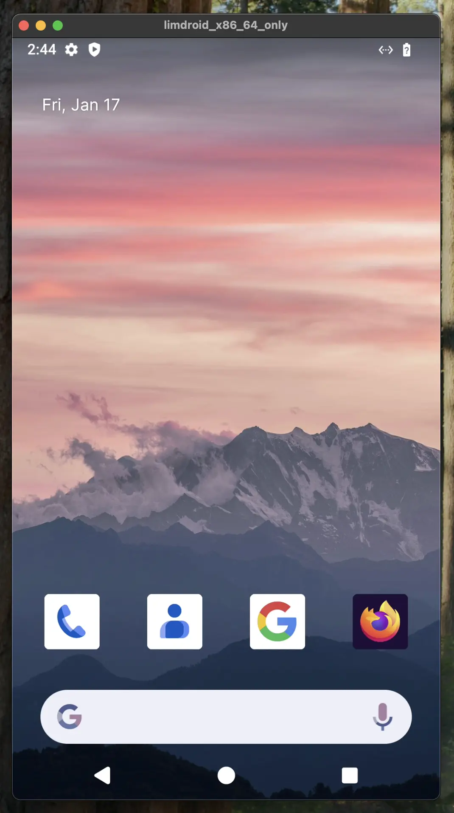

# Android Emulator Fleet

Run this action to create unlimited remote Android emulator instances in
[Limbar](https://limbar.io) so that you can test all your automated UI tests in
parallel.

<p align="center">
  
</p>

## Inputs

### `token`

**Required** The token to use to authenticate with Limbar.

You can get this token in [Limbar Console](https://console.limbar.io/settings).

### `organization-id`

**Optional** The organization to create the Android instance in. If not given,
the default organization from the token is used.

You can get this ID in [Limbar Console](https://console.limbar.io/settings) but
organization tokens already contain it, so in most cases, you don't need to
supply this.

### `region`

**Optional** The region to create the Android instance in. The closest one is
chosen if not given.

See [Limbar Console](https://console.limbar.io) for a list of regions or run
`lim regions`.

## Example usage

The following step will create a new Android emulator instance in the default
organization and region, and connect to it. Once it's available, which usually
takes less than a second, you can start all the mobile testing automation tools
you have, like `maestro`, Appium, Behave and the rest.

Once the GitHub workflow completes, a post-action step will clean up the
instance.

```yaml
- name: Run Android
  uses: limbario/run-android@v0.2.0
  with:
    token: ${{ secrets.LIM_TOKEN }}

- name: Run tests
  run: ./gradlew connectedCheck --stacktrace
```

## Testing with 20 Android Emulators in Parallel

In [Limbar](https://limbar.io), you can have as many remote Android emulator
instances as you need without additional cost to quickly finish all the tests
your app has. A `count` parameter is provided to utilize this so that you don't
have to have a separate GitHub Actions job for every Android emulator instance.

The following GitHub Actions steps does the following:

- Provision 20 Android Emulator instances at once,
- Install your app's APK file to all of them,
- Run `maestro` with `--shard-split=20` flag so that it utilizes all 20 of the
  Android emulator instances in parallel.

Increase the count as many as your UI tests so that you can iterate on the
results quickly and save great amount of time.

```yaml
- name: Run Android
  uses: limbario/run-android@v0.2.0
  with:
    token: ${{ secrets.LIM_TOKEN }}
    count: 20

- name: Install APK in parallel
  run: |
    #!/bin/bash
    # Get all connected devices
    devices=$(adb devices | grep -v "List" | grep "localhost" | cut -f1)
    # Install APK on each device in parallel
    for device in $devices; do
        (
            echo "Installing on device: $device"
            adb -s $device install apk/pr-debug.apk
        ) &
    done
    # Wait for all parallel installations to complete
    wait
    echo "Installation completed on all devices"

- name: Run Tests in parallel
  run: |
    maestro test .maestro --shard-split=20
```

You can watch the Android emulator screens while the tests are ongoing by going
to [Limbar Console](https://console.limbar.io) and get the `lim connect` command
to stream the screen to your desktop live.
